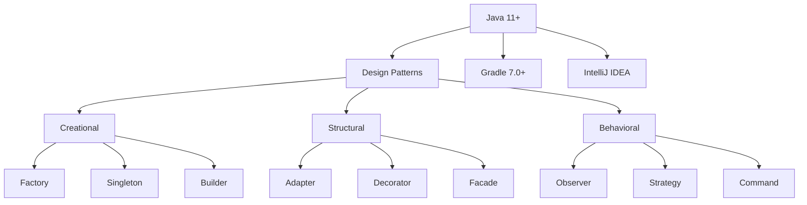

# 🚀 Java Design Pattern Mastery

<div align="center">


</div>

> 💡 A comprehensive showcase of professional Java design pattern implementations, demonstrating enterprise-grade software architecture and development practices. This repository highlights advanced OOP principles, design pattern mastery, and production-ready implementations.

## 📋 Table of Contents
- [Projects Overview](#-projects-overview)
- [Technical Stack](#-technical-stack)
- [Project Structure](#-project-structure)
- [Getting Started](#-getting-started)
- [Design Patterns](#-design-patterns)
- [Implementation Details](#-implementation-details)
- [Skills Showcase](#-skills-showcase)
- [Contact](#-contact)

## 🏢 Projects Overview

### 📦 Assignment 4: Core Design Patterns
<div align="center">

| Category | Implementation | Complexity | Documentation |
|----------|----------------|------------|---------------|
| **Patterns** | Factory, Observer, Strategy | ⭐⭐⭐ | UML diagrams |
| **Focus** | Fundamental pattern implementation | ⭐⭐ | Design rationale |
| **Testing** | Unit tests, Integration tests | ⭐⭐⭐ | Test documentation |
| **Performance** | Optimized implementations | ⭐⭐⭐ | Performance metrics |

</div>

### 🏗️ Assignment 5: Advanced Architecture
<div align="center">

| Category | Implementation | Complexity | Documentation |
|----------|----------------|------------|---------------|
| **Patterns** | Composite, Decorator, State | ⭐⭐⭐⭐ | Architecture diagrams |
| **Focus** | Complex system design | ⭐⭐⭐⭐ | Design decisions |
| **Testing** | Comprehensive test suite | ⭐⭐⭐⭐ | Test coverage reports |
| **Performance** | High-performance design | ⭐⭐⭐⭐ | Benchmark results |

</div>

### 🚀 Assignment 6: Production Applications
<div align="center">

| Category | Implementation | Complexity | Documentation |
|----------|----------------|------------|---------------|
| **Patterns** | Command, Template, Visitor | ⭐⭐⭐⭐⭐ | Technical specifications |
| **Focus** | Real-world applications | ⭐⭐⭐⭐⭐ | Implementation guidelines |
| **Testing** | Production-grade testing | ⭐⭐⭐⭐⭐ | QA documentation |
| **Performance** | Enterprise-grade optimization | ⭐⭐⭐⭐⭐ | Performance analysis |

</div>

## ⚙️ Technical Stack


## 📁 Project Structure
```bash
├── 📂 assignment4/
│   ├── 📂 src/
│   │   ├── 📂 main/
│   │   │   ├── 📂 java/
│   │   │   │   ├── 📂 creational/
│   │   │   │   ├── 📂 structural/
│   │   │   │   └── 📂 behavioral/
│   │   │   └── 📂 resources/
│   │   └── 📂 test/
│   │       ├── 📂 java/
│   │       └── 📂 resources/
│   ├── 📄 build.gradle
│   └── 📂 docs/
│       ├── 📄 UML.png
│       └── 📄 design.md
│
├── 📂 assignment5/
│   ├── 📂 src/
│   │   ├── 📂 main/
│   │   │   ├── 📂 java/
│   │   │   │   ├── 📂 patterns/
│   │   │   │   └── 📂 architecture/
│   │   │   └── 📂 resources/
│   │   └── 📂 test/
│   │       ├── 📂 java/
│   │       └── 📂 resources/
│   ├── 📄 build.gradle
│   └── 📂 docs/
│       ├── 📄 architecture.png
│       └── 📄 decisions.md
│
└── 📂 assignment6/
    ├── 📂 src/
    │   ├── 📂 main/
    │   │   ├── 📂 java/
    │   │   │   ├── 📂 application/
    │   │   │   └── 📂 patterns/
    │   │   └── 📂 resources/
    │   └── 📂 test/
    │       ├── 📂 java/
    │       └── 📂 resources/
    ├── 📄 build.gradle
    └── 📂 docs/
        ├── 📄 implementation.png
        └── 📄 guidelines.md
```

## 🛠️ Getting Started

### Prerequisites
- Java JDK 11+
- Gradle 7.0+
- IntelliJ IDEA
- Git

### Installation
```bash
# Clone the repository
git clone https://github.com/your-username/java-design-patterns.git

# Navigate to project
cd java-design-patterns/assignmentX

# Build the project
./gradlew clean build

# Run tests
./gradlew test

# Run the project
./gradlew run
```

## 🎯 Design Patterns

### Creational Patterns
- **Factory Pattern**: Dynamic object creation
- **Singleton Pattern**: Global state management
- **Builder Pattern**: Complex object construction

### Structural Patterns
- **Adapter Pattern**: Interface compatibility
- **Decorator Pattern**: Dynamic behavior extension
- **Facade Pattern**: Simplified subsystem access

### Behavioral Patterns
- **Observer Pattern**: Event handling
- **Strategy Pattern**: Algorithm encapsulation
- **Command Pattern**: Action encapsulation

## 💻 Implementation Details

### Code Quality
```java
// Example of clean, well-documented code
public class FactoryPattern {
    /**
     * Creates an instance of the specified product type
     * @param type The type of product to create
     * @return A new product instance
     */
    public Product createProduct(ProductType type) {
        return switch (type) {
            case TYPE_A -> new ProductA();
            case TYPE_B -> new ProductB();
            default -> throw new IllegalArgumentException("Invalid product type");
        };
    }
}
```

### Testing Strategy
- Unit Testing with JUnit
- Integration Testing
- Performance Testing
- Code Coverage Analysis

## 💪 Skills Showcase

### Technical Expertise
1. **Design Patterns** 🎯
   - Creational Patterns
   - Structural Patterns
   - Behavioral Patterns
   - Pattern Combinations

2. **Software Architecture** 🏗️
   - System Design
   - Scalability
   - Performance
   - Maintainability

3. **Development Practices** 📈
   - Clean Code
   - Testing
   - Documentation
   - Code Review

### Project Highlights
- 🚀 Enterprise-grade implementations
- ⚡ Performance optimization
- ✅ Production-ready code
- 📋 Professional documentation
- 🧪 Comprehensive testing
- 🔍 Code quality analysis

## 👨‍💻 Contact
**Saumya Mishra** - Software Engineer

<div align="center">

[](https://github.com/saumya-mt)
[](https://www.linkedin.com/in/your-profile)
[](mailto:your-email@example.com)

</div>

## 📄 License
This project is licensed under the MIT License - see the [LICENSE](LICENSE) file for details 
