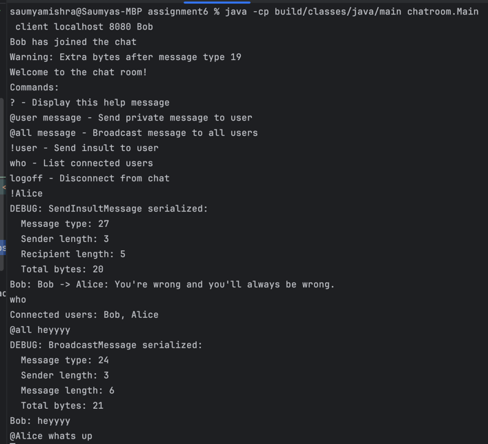
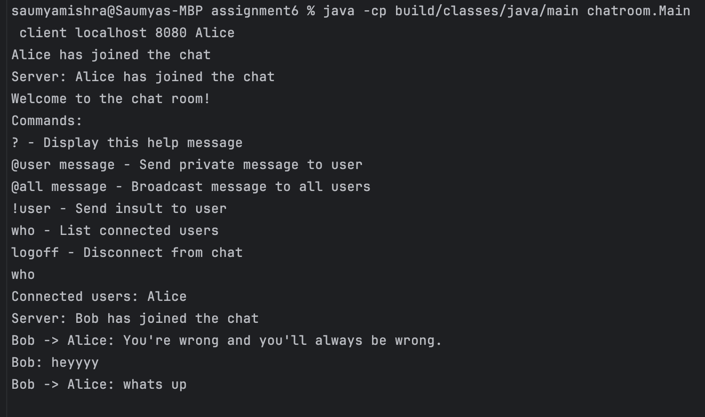

# Chat Room Application

A Java-based chat room application that supports multiple concurrent users, direct messaging, and special features like insult generation.

## Building the Project

Build the project using Gradle:
```bash
./gradlew build
```

## Running the Application

### Starting the Server
Open a terminal and run:
```bash
java -cp build/classes/java/main chatroom.Main server <port>
```
Example:
```bash
java -cp build/classes/java/main chatroom.Main server 8080
```

### Starting a Client
Open a new terminal for each client and run:
```bash
java -cp build/classes/java/main chatroom.Main client <host> <port> <username>
```
Example:
```bash
java -cp build/classes/java/main chatroom.Main client localhost 8080 Alice
```

You can start multiple clients (up to 15) to interact with each other.

## Key Features

- Multi-user chat support (up to 15 concurrent users)
- Broadcast messaging to all users
- Direct messaging between users
- Insult generation and sending
- User connection/disconnection notifications
- Query connected users list

## Key Classes and Methods

### Main Classes
- `Main`: Entry point of the application, handles command-line arguments
- `ChatServer`: Manages client connections and message routing
- `ChatClient`: Handles client-side communication and UI
- `ClientHandler`: Manages individual client connections on the server
- `ConsoleUI`: Handles user input and display

### Message Types
- Connect/Disconnect messages
- Broadcast messages
- Direct messages
- Insult messages
- Query messages for user list

## Implementation Details

### Assumptions
- Users have unique usernames
- Server runs on a single port
- All messages are text-based
- UTF-8 encoding for all messages
- Network is reliable (basic error handling implemented)

### Correctness Measures
- Synchronized message handling
- Thread-safe client management
- Input validation for all messages
- Proper connection/disconnection handling
- Comprehensive error handling
- Extensive unit tests
- Message type validation

## Running from IntelliJ IDEA

1. Open the project in IntelliJ IDEA
2. Build the project (Build -> Build Project)
3. To run the server:
   - Create a new Run Configuration
   - Main class: `chatroom.Main`
   - Program arguments: `server 8080`
4. To run a client:
   - Create another Run Configuration
   - Main class: `chatroom.Main`
   - Program arguments: `client localhost 8080 <username>`




